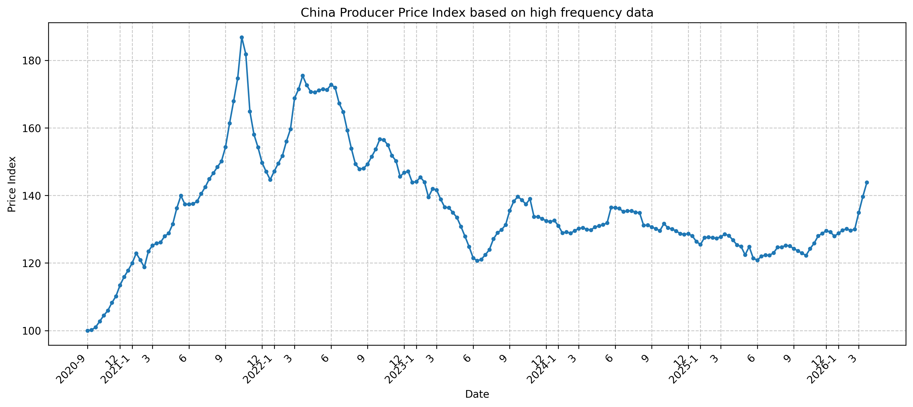
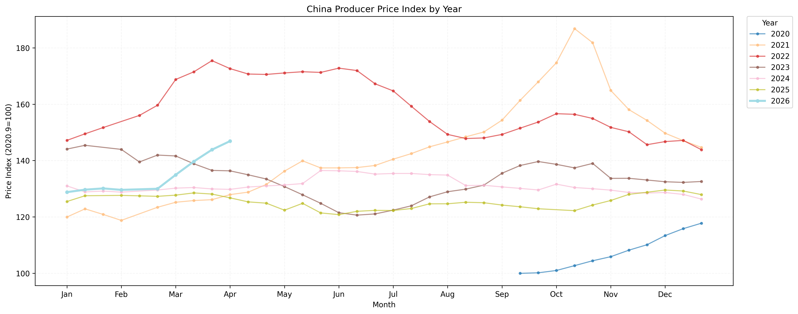
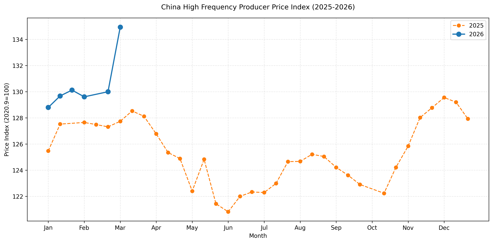

# Dada Price Index





This project builds a high‑frequency Producer Price Index (PPI) from the National Bureau of Statistics “Important Means of Production Price Changes” releases. The base period is **mid‑September 2020 = 100**, and the methodology change from **late December 2025 to early January 2026** is chain‑linked for continuity. The pipeline covers crawling, index calculation, visualization, and SQLite storage.

## Basic Stats (Current DB Output)

Running `python py/update.py` or `python py/update.py --chart` prints the latest indicators. Based on the current `data/price_data.db`, the latest output is:

```
Latest: 2026-01 (mid)
Price Index: 129.67
MoM: 0.68%
YoY: 1.69%
```

Use `python py/update.py --status` for database summary statistics.

## Project Structure

```
/workspace/dada-price-index
├── data/
│   └── price_data.db       # SQLite database
├── charts/                 # Chart outputs
└── py/
    ├── data_utils.py       # Crawling & incremental updates
    ├── db_manager.py       # SQLite access layer
    ├── index_builder.py    # Index + chain-linking
    ├── chart_maker.py      # Visualization
    ├── update.py           # Main update entry
    └── migrate_to_sqlite.py # pickle -> SQLite migration
```

## Data Source & Methodology

- Source: NBS “Important Means of Production Price Changes” releases
- Frequency: ten‑day periods (early/mid/late)
- Base: mid‑September 2020 = 100
- Methodology change (from Jan 2026): removed/added/spec‑changed items are configured in `py/index_builder.py` and linked via average MoM change.

## Main Workflow

Running `py/update.py` performs:

1. **Update release links**
2. **Fetch price tables** (store in SQLite)
3. **Compute index** (incremental preferred, fallback to full rebuild)
4. **Show stats and generate charts**

## Common Commands

```bash
# Incremental update (recommended)
python py/update.py

# Full rebuild
python py/update.py --full

# Charts only
python py/update.py --chart

# Verify incremental vs full
python py/update.py --verify

# Migration (pickle -> SQLite)
python py/update.py --migrate

# DB status
python py/update.py --status
```

## Dependencies

```bash
pip install -r requirements.txt
```
